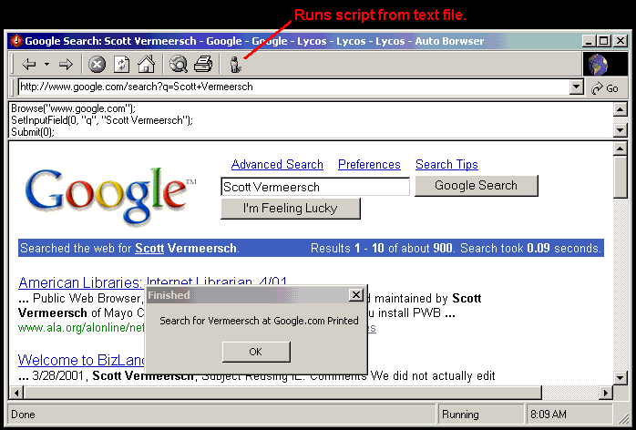

## Auto Browser

### Description

Just like the good old days with Procomm and Telix, Auto Browser parses a script file and executes the commands. Currently the browser is able to browser to URLs, fill in input boxs, show dialog boxes, and print. Not only can it run scripts, but it is feature rich web browser. The source is heavily commented, and is a good base to write an even better browser from.
 
### More Info
 

             |
---                |---
**Submitted On**   |2001-08-09 07:58:20
**By**             |[Scott Vermeersch](https://github.com/Planet-Source-Code/PSCIndex/blob/master/ByAuthor/scott-vermeersch.md)
**Level**          |Intermediate
**User Rating**    |4.6 (32 globes from 7 users)
**Compatibility**  |VB 6\.0
**Category**       |[Internet/ HTML](https://github.com/Planet-Source-Code/PSCIndex/blob/master/ByCategory/internet-html__1-34.md)
**World**          |[Visual Basic](https://github.com/Planet-Source-Code/PSCIndex/blob/master/ByWorld/visual-basic.md)
**Archive File**   |[Auto Brows24324892001\.zip](https://github.com/Planet-Source-Code/scott-vermeersch-auto-browser__1-26015/archive/master.zip)

